# 🚀 Developer Guide: Automated Branching & Release Process

## 🎯 Quick Start for Developers

This repository uses **fully automated releases**. As a developer, you only need to:

1. **Create feature branches** from `develop`
2. **Create PRs** to `develop` 
3. **Let maintainers handle releases** with Rush commands

That's it! No manual version management, no complex procedures.

## 🌳 Branching Strategy


### Branch Types (Detailed Flow)

| Branch | Purpose | Creation | Created From | Merged To | Post-Merge Action |
|--------|---------|----------|--------------|-----------|-------------------|
| **`main`** | 🏆 **Production releases**<br/>Contains only stable, production-ready code | 🤖 **Automated** | N/A | N/A | 🤖 **Auto-syncs** to `develop` + `beta` |
| **`develop`** | 🔄 **Feature integration**<br/>Where all feature development is integrated and tested | 👨‍💻 **Manual** | `main` | `beta-TIMESTAMP` | 👨‍💻 **Manual** development continues |
| **`beta`** | 🧪 **Persistent beta branch**<br/>Long-lived branch for beta releases and testing | 👨‍💻 **Manual** | `main` | N/A | 🤖 **Auto-receives** syncs from `main` |
| **`beta-TIMESTAMP`** | 📅 **Timestamped beta releases**<br/>Short-lived branches for specific beta versions | 🤖 **Automated** | `develop` | `main` | 🤖 **Auto-deleted** after merge |
| **`hotfix-TIMESTAMP`** | 🚨 **Emergency fixes**<br/>Critical production bug fixes | 🤖 **Automated** | `main` | `main` + `develop` + `beta` | 🤖 **Auto-deleted** after merge |
| **`feature/*`** | ✨ **Your feature work**<br/>Individual developer feature branches | **Developers** | `develop` | `develop` | Deleted after merge |

## 👨‍💻 Developer Workflow

### 1. Feature Development (What **YOU** Do as a Developer)


**👨‍💻 MANUAL Commands YOU run as a developer:**
```bash
# 🎯 First time setup
git clone <repo-url>
cd electrode
rush dev-setup              # Interactive onboarding

# 🔄 For each feature
git checkout develop
git pull origin develop
git checkout -b feature/my-awesome-feature

# 💻 Development & testing
rush build                   # Build packages
rush test                    # Run tests
rush lint                    # Lint code

# 📤 Push your work
git add .
git commit -m "feat: add awesome feature"
git push origin feature/my-awesome-feature
# Create PR via GitHub UI to develop branch
# 🤖 AUTO: CI/CD validates your PR when submitted
```

### 2. Release Process (What **MAINTAINERS** Do)

```mermaid
flowchart TD
    A["Features merged to develop"] --> B["MANUAL: Maintainer runs rush release:beta 'description'"]
    B --> C["AUTO: Creates beta-TIMESTAMP from develop"]
    C --> D["AUTO: Detects changed packages + applies/increments beta versions"]
    D --> E["AUTO: rush build + rush test + rush lint"]
    E --> F["AUTO: Push beta branch → triggers CI/CD"]
    F --> G["AUTO: CI/CD publishes to npm with @beta tag"]
    
    G --> H["MANUAL: Beta testing & validation by team"]
    H --> I["MANUAL: Maintainer runs rush release:stable"]
    I --> J["AUTO: Merge beta-TIMESTAMP → main"]
    J --> K["AUTO: Remove -beta suffixes from changed packages"]
    K --> L["AUTO: CI/CD publishes to npm with @latest tag"]
    L --> M["AUTO: Sync main → develop + beta"]
    
    style B fill:#e3f2fd,stroke:#1976d2,stroke-width:3px
    style H fill:#fff3e0,stroke:#f57c00,stroke-width:3px
    style I fill:#e8f5e8,stroke:#388e3c,stroke-width:3px
    style C fill:#f3e5f5,stroke:#7b1fa2,stroke-width:2px
    style D fill:#f3e5f5,stroke:#7b1fa2,stroke-width:2px
    style E fill:#f3e5f5,stroke:#7b1fa2,stroke-width:2px
    style F fill:#f3e5f5,stroke:#7b1fa2,stroke-width:2px
    style G fill:#f3e5f5,stroke:#7b1fa2,stroke-width:2px
    style J fill:#f3e5f5,stroke:#7b1fa2,stroke-width:2px
    style K fill:#f3e5f5,stroke:#7b1fa2,stroke-width:2px
    style L fill:#f3e5f5,stroke:#7b1fa2,stroke-width:2px
    style M fill:#f3e5f5,stroke:#7b1fa2,stroke-width:2px
```



**👨‍💻 MANUAL Commands MAINTAINERS run (locally on their machines):**
```bash
# 🧪 Beta release preparation (triggers automation)
rush release:beta "react-19-support-features"

# 🏆 Stable release (triggers automation after beta testing)  
rush release:stable

# 🚨 Emergency hotfix (triggers automation for critical bugs)
rush release:hotfix "critical-security-fix"
```

**What happens when maintainers run these commands:**

### `👨‍💻 MANUAL: rush release:beta "description"` → Triggers Automation
1. **🤖 AUTO: Validates** git status and branch (maintainer's machine)
2. **🤖 AUTO: Creates** `beta-TIMESTAMP` branch from develop (maintainer's machine)
3. **🤖 AUTO: Detects** changed packages and applies/increments beta versions (maintainer's machine)
4. **� AUTO: Builds & tests** everything locally (maintainer's machine)  
5. **🤖 AUTO: Pushes** beta branch to GitHub (maintainer's machine)
6. **🤖 AUTO: Triggers** GitHub Actions workflow (CI/CD)
7. **🤖 AUTO: Publishes** to npm with @beta tag (CI/CD - secure)

### Why This Hybrid Approach?
- **🔒 Security**: npm publishing happens in CI with secured tokens
- **✅ Validation**: Build/test validation happens locally first  
- **🎯 Control**: Maintainers control when releases start
- **📊 Transparency**: All publishing is logged in GitHub Actions

### ⚠️ **Handling Failures**
**If anything fails during the process:**
- **Local failures** (git status, build, test, lint): Fix the issue and retry the command - no branch is created so it's safe
- **CI/CD failures** (publishing, authentication): Check GitHub Actions logs, fix issues, and push to the same beta branch again
- **Emergency recovery**: `git checkout develop && git branch -D beta-TIMESTAMP` to start over clean

**Commands maintainers run:**
```bash
# Beta release (for testing)
rush release:beta "react-19-support-features"

# Stable release (after testing)
rush release:stable

# Emergency hotfix
rush release:hotfix "critical-security-fix"
```

## 📦 Package Usage

### For External Users Installing Packages

```bash
# 🏆 Latest stable (recommended for production)
npm install @xarc/app
npm install @xarc/react

# 🧪 Beta versions (for testing new features)
npm install @xarc/app@beta
npm install @xarc/react@beta

# 📌 Specific version
npm install @xarc/app@1.0.1-beta.1

# 🔍 Check available versions
npm view @xarc/app versions --json
```

### For Developers Working in This Repo

```bash
# Use Rush commands for development:

rush install                 # Install all dependencies
rush build                   # Build all packages  
rush test                    # Run all tests
rush lint                    # Lint all packages
rush clean                   # Clean all packages
```

## 🏷️ Versioning Strategy

The repository uses **semantic versioning (SemVer)** with automated change detection powered by **Rush change files**:

### Version Types and Change Files
When you make changes, `rush change` prompts you to specify the impact level:

- **🔴 Major (X.0.0)**: Breaking changes that require consumer updates
- **🟡 Minor (X.Y.0)**: New features that are backward compatible  
- **🟢 Patch (X.Y.Z)**: Bug fixes and small improvements

**Rush analyzes your change files** to determine the appropriate version bump. For example:
- Change file with `"type": "major"` → triggers major version bump
- Change file with `"type": "minor"` → triggers minor version bump
- Change file with `"type": "patch"` → triggers patch version bump

### Version Policies
The repository uses **Rush version policies** defined in `common/config/rush/version-policies.json`:

- **`xarcAppVersion`**: Lock-step versioning for core @xarc packages (currently v12.0.0)
- **`archetypeDllVersion`**: Lock-step versioning for archetype packages (currently v3.0.6)
- **Individual packages**: Use independent versioning based on change files

### Beta Versioning
- Beta releases use suffix: `1.2.3-beta.0`, `1.2.3-beta.1`, etc.
- Each new beta increments the beta number for iterative testing
- Promotes to stable by removing the suffix: `1.2.3-beta.2` → `1.2.3`
- **Version increment logic**: If a package already has a beta suffix, the script increments it; otherwise, it adds `-beta.0`

### Hotfix Versioning
- **Hotfixes are released as stable versions** (no special suffix)
- Rush determines the version bump (patch/minor/major) based on change files
- Hotfixes typically result in patch releases (e.g., `1.2.3` → `1.2.4`)
- Released immediately to `latest` tag on npm for urgent production fixes

### Version Bump Examples

**Rush change file determines the version bump:**

Example change file (`common/changes/@xarc/app-dev/feature-new-api_2025-01-20.json`):
```json
{
  "changes": [
    {
      "packageName": "@xarc/app-dev",
      "comment": "Add new authentication API with OAuth2 support",
      "type": "minor"
    }
  ]
}
```

**Version progression for different bump types:**
```bash
# Starting version: @xarc/app-dev@1.2.3

# Patch bump (bug fixes)
rush change → "type": "patch" → 1.2.4

# Minor bump (new features) 
rush change → "type": "minor" → 1.3.0

# Major bump (breaking changes)
rush change → "type": "major" → 2.0.0

# Beta releases (any change type + beta suffix)
rush change → "type": "minor" + beta → 1.3.0-beta.0
```

**Real-world example with multiple packages:**
```bash
# Before release (rush version --bump):
@xarc/app@11.2.5
@xarc/react@2.1.4  
webpack-config-composer@1.2.3

# Change files specify:
# - @xarc/app: "type": "major" (breaking API change)
# - @xarc/react: "type": "minor" (new hooks)
# - webpack-config-composer: "type": "patch" (bug fix)

# After rush version --bump:
@xarc/app@12.0.0           # Major bump
@xarc/react@2.2.0          # Minor bump  
webpack-config-composer@1.2.4  # Patch bump
```
## 🔄 Iterative Beta Releases

Multiple beta releases are common during development cycles. The system intelligently handles version incrementing:


### Version Progression Example (Iterative Beta Releases)

```bash
# 📊 Repository status: 35 packages total, showing iterative beta workflow

# Starting state - Current stable packages
@xarc/app@1.0.0
@xarc/react@2.1.5  
webpack-config-composer@1.2.3

# First beta release (rush release:beta "initial-features")
@xarc/app@1.0.1-beta.0           # ✅ First beta with new changes
@xarc/react@2.1.6-beta.0         # ✅ First beta with new features
webpack-config-composer@1.2.4-beta.0  # ✅ First beta with bug fixes

# Second beta release after more changes (rush release:beta "bug-fixes")
@xarc/app@1.0.1-beta.1           # 🔄 Incremented from beta.0 → beta.1
@xarc/react@2.1.6-beta.0         # 🔒 No new changes, stays same
webpack-config-composer@1.2.4-beta.1  # 🔄 Incremented from beta.0 → beta.1

# Third beta release (rush release:beta "more-features")
@xarc/app@1.0.1-beta.2           # 🔄 Incremented from beta.1 → beta.2
@xarc/react@2.1.6-beta.1         # 🔄 Now has changes, incremented to beta.1
webpack-config-composer@1.2.4-beta.1  # 🔒 No new changes, stays same

# Final stable promotion (rush release:stable)
@xarc/app@1.0.1                  # ✅ Removes -beta.2 suffix
@xarc/react@2.1.6                # ✅ Removes -beta.1 suffix  
webpack-config-composer@1.2.4    # ✅ Removes -beta.1 suffix
```

### Smart Beta Version Logic

- **🆕 New to beta**: `1.0.0` → `1.0.1-beta.0`
- **🔄 Already beta**: `1.0.1-beta.0` → `1.0.1-beta.1` → `1.0.1-beta.2`
- **🔒 No changes**: Version stays the same (no unnecessary increments)
- **🏆 Stable promotion**: `1.0.1-beta.2` → `1.0.1` (removes beta suffix)

## 🚨 Emergency Hotfix Process


**Important: Hotfixes are released as stable versions (no `-hotfix` suffix)**
- Hotfix `1.2.3` → `1.2.4` (immediate patch release)
- Published to npm with `latest` tag for urgent production deployment
- Version determined by Rush change files (typically patch, but can be minor/major)


**What you do as developer:**
```bash
# � Start hotfix process
rush release:hotfix "fix-memory-leak"

# 🤖 Automation creates branch and pauses
# You see: "Created hotfix-2025-01-20T15-45-00. Please make your fixes now."

# � Make your fixes (use Rush commands!)
rush build                   # Verify build works
rush test                    # Verify tests pass
git add .
git commit -m "fix: resolve memory leak in component"

# ▶️ Continue the automated process
# Automation handles: publish, merge to main+develop+beta, cleanup
```

## � **Beta Version Bumps: How Major/Minor/Patch is Determined**

**Version bumps in beta releases are determined by Rush change files, just like stable releases:**

### **🎯 When you run `rush change`, you specify the impact:**
```bash
rush change
# Rush prompts: "What type of change is this?"
# Options: major, minor, patch, none
```

### **� Example change file:**
```json
{
  "changes": [
    {
      "packageName": "@xarc/app",
      "comment": "Add new authentication API",
      "type": "minor"    ← This determines the version bump
    }
  ]
}
```

### **🏷️ Version progression examples:**

**Starting from stable `1.2.3`:**
```bash
# Change file says "type": "patch"
1.2.3 → 1.2.4-beta.0 → 1.2.4-beta.1 → 1.2.4 (stable)

# Change file says "type": "minor"  
1.2.3 → 1.3.0-beta.0 → 1.3.0-beta.1 → 1.3.0 (stable)

# Change file says "type": "major"
1.2.3 → 2.0.0-beta.0 → 2.0.0-beta.1 → 2.0.0 (stable)
```

**✅ Key Point:** Rush reads the change files and calculates the appropriate version bump BEFORE adding the `-beta` suffix. The beta suffix is just an addition, the core version increment follows standard SemVer rules.

## References

### **Standards**

- **Modified GitFlow** for **package publishing** (feature → develop → main) - adapted for npm package release cycles
- **SemVer 2.0.0** with automated change detection via Rush for package versioning
- **Monorepo** management with smart change detection and independent package versioning
- **Hybrid CI/CD** with local validation + secure npm package publishing
- **Beta-to-stable** package release lifecycle with iterative testing

### **Key References**

1. **[npm Package Publishing Guide](https://docs.npmjs.com/packages-and-modules/contributing-packages-to-the-registry)** - Documentation for package development lifecycle, including beta/pre-release publishing

2. **[Semantic Versioning 2.0.0](https://semver.org/)** - Specification for MAJOR.MINOR.PATCH versioning and pre-release identifiers (`-beta.0`, `-alpha.1`)

3. **[Rush.js Publishing Strategies](https://rushjs.io/pages/maintainer/publishing/)** - Documentation for monorepo publishing, change detection, and release automation

4. **[Release Please](https://github.com/googleapis/release-please)** - Automated release strategy with similar automation principles for package publishing

5. **[GitHub Flow vs GitFlow](https://www.atlassian.com/git/tutorials/comparing-workflows/gitflow-workflow)** - Comparison of branching workflows and contexts where each approach applies

