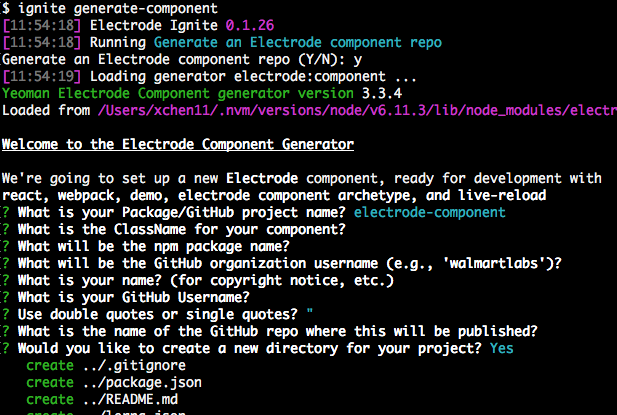

# Getting Started With Electrode Components

> Before proceeding, be sure to verify the [Requirements](../../overview/requirements.md) for setting up your development environment.

## Quick Guide

You can start your component using the Ignite Menu or using the Ignite Single task.

- Ignite Menu

```bash
$ ignite
```

And choose the option for `Generate an Electrode component`.

- Ignite Single task

```bash
$ ignite generate-component
```

Fill out the information for your component. You can press enter to select all the defaults, except for specifying a name for your component.

For example:



After the installation is complete, your new Electrode component is ready!

## Example and Preview

Preview your component using the demo-app. This is an Electrode app that uses your newly created component.

```bash
$ cd <your-component>/demo-app
$ clap dev
```

When the component starts, you should see the status in your terminal:


A webserver will start on localhost:3000. Your new component will be used in `demo-app/src/client/components/home.jsx`. Now, open [localhost:3000](http://localhost:3000/) in your browser to access the component.


## Adding More Components to the Packages

> You can skip this section if you do not need extra components.

There are two ways to add more components to your project. You can use the Ignite menu or specify the task name.

> Make sure you are under the `packages` directory before you run the following commands.

- Ignite Menu

```bash
$ ignite
```

Specify option `5` for `Add a component to your existing component repo`.

- Ignite Single task

```bash
$ ignite add-component
```

Follow the prompts as above. For example:


A new package will be generated and the demo-app is updated. Don't worry if you see any conflicts, the `demo-app/src/client/components/home.jsx` and `demo-app/package.json` are expected to be overwritten during the update.

> If you installed `yo` at version 2.0.0 or higher, you can specify the `a` option to `overwrite this and all others`, or you need to specify the `y` option to `overwrite` each time.

The the installation is complete, you can preview the multi-components by using the demo-app again.

```bash
$ cd ../../demo-app/
$ clap dev
```

The terminal window will display the status:


Open [localhost:3000](http://localhost:3000/) in your browser to access the component.


---

## Project Structure

The new Electrode component is applied. The Lerna structure can help manage multiple repositories within your packages directory.

```
electrode-component
    ├── demo-app
    │   ├── LICENSE
    │   ├── README.md
    │   ├── config
    │   ├── xclap.js
    │   ├── src
    │   │   ├── client
    │   │   └── server
    │   └── test
    │       ├── client
    │       └── server
    └── packages
        └── <componentName>
            ├── README.md
            ├── xclap.js
            ├── package.json
            ├── demo
            ├── src
            │   ├── components
            │   ├── index.js
            │   ├── lang
            │   └── styles
            └── test
                └── client
```

- `demo-app` - Directory for Electrode Application—used for developing and testing your `packages/<componentName>`. You need to import your `packages/<componentName>` to demo-app, explore and personalize this web application there.
- `packages/<componentName>/xclap.js` - Electrode archetype tasks.
- `packages/<componentName>/demo` - Examples for how to demo your component.
- `packages/<componentName>/src` - Component source code.
- `packages/<componentName>/test` - Unit tests for your component.

To continue developing components, see [Developing Electrode Components.](../further-develop-component/low-level-components.md)
