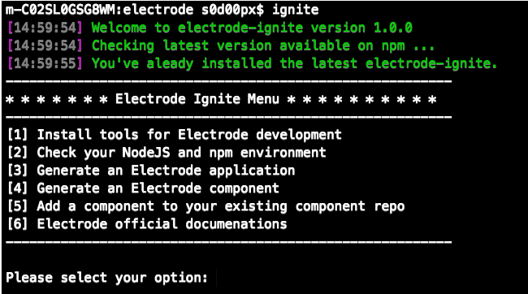
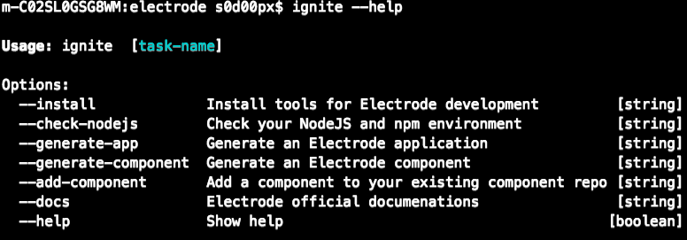

# Electrode Ignite

A CLI tool for development with OSS Electrode React/NodeJS Platform.

## Installation

Install the `electrode-ignite` globally

```bash
$ npm install -g electrode-ignite
```

## Usage

Electrode Ignite provides developers a cli tool to develop on OSS Electrode React/NodeJS Platform. It offers a list of tasks that you can invoke functions on Electrode platform.

There are two ways to start the Electrode Ignite:

- Electrode Ignite Menu

To see the Electrode Ignite menu, simple run:

```bash
$ ignite
```

And you'll see the menu as below:



Select the option by inputting a valid number, and press enter to get your task executed.

- Electrode Ignite Single Task

An ignite task can be invoked with the command `ignite`:

```bash
$ ignite [task name]
```

For example,

```bash
$ ignite install
```

For help on usage:

```bash
$ ignite --help
```

You'll see the list of options that you can specify as a task, as below:



## Development

To run in development

```sh
% npm i
% npx ignite
```

## License

Apache-2.0 © WalmartLabs

Built with :heart: by [Team Electrode](https://github.com/orgs/electrode-io/people) @WalmartLabs.
